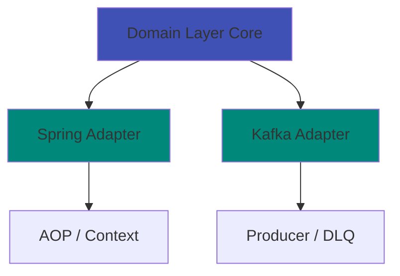
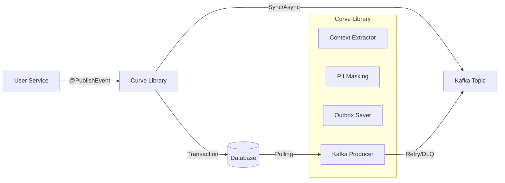

<div align="center">

# Curve

**Spring Boot 마이크로서비스를 위한 선언적 이벤트 발행 라이브러리**

[](https://openjdk.java.net/)
[](https://spring.io/projects/spring-boot)
[](https://kafka.apache.org/)
[](LICENSE)
[](https://github.com/closeup1202/curve/actions)
[](https://codecov.io/gh/closeup1202/curve)
[](https://sonarcloud.io/project/overview?id=closeup1202_curve)

[English](README.md) | [한국어](README.ko.md)

</div>

---

## Project Stats


---

## Quick Start

```java
// 어노테이션 하나만 추가하면 끝!
@PublishEvent(eventType = "USER_CREATED")
public User createUser(CreateUserRequest request) {
    return userRepository.save(new User(request));
}
```

**→ Kafka 자동 발행 + PII 마스킹 + 실패 시 DLQ + 메트릭 수집** ✨

<!-- 데모 GIF 추가:  -->

---

## Why Curve?

<table>
<tr>
<td width="50%">

### Before (기존 방식)
```java
// 50줄 이상의 보일러플레이트 코드
@Service
public class UserService {

    @Autowired
    private KafkaTemplate<String, Object> kafka;

    @Autowired
    private ObjectMapper objectMapper;

    public User createUser(UserRequest request) {
        User user = userRepository.save(
            new User(request)
        );

        try {
            // 수동으로 이벤트 생성
            EventEnvelope event = EventEnvelope.builder()
                .eventId(UUID.randomUUID().toString())
                .eventType("USER_CREATED")
                .occurredAt(Instant.now())
                .publishedAt(Instant.now())
                .metadata(/* ... */)
                .payload(/* ... */)
                .build();

            // 수동으로 PII 마스킹
            String json = maskPii(
                objectMapper.writeValueAsString(event)
            );

            // 수동으로 Kafka 전송 및 재시도
            kafka.send("user-events", json)
                .get(30, TimeUnit.SECONDS);

        } catch (Exception e) {
            // 수동으로 에러 처리
            log.error("Failed to publish event", e);
            sendToDlq(event);
        }

        return user;
    }
}
```

</td>
<td width="50%">

### After (Curve)
```java
// 어노테이션 하나만!
@Service
public class UserService {

    @PublishEvent(eventType = "USER_CREATED")
    public User createUser(UserRequest request) {
        return userRepository.save(
            new User(request)
        );
    }
}
```

**코드 90% 감소**

모든 것이 자동으로 처리됩니다:
- ✅ 이벤트 ID 생성
- ✅ 메타데이터 추출
- ✅ PII 마스킹
- ✅ Kafka 발행
- ✅ 재시도 & DLQ
- ✅ 메트릭 수집

</td>
</tr>
</table>

---

## Key Features

### 선언적 이벤트 발행
Kafka 보일러플레이트 코드 불필요 - `@PublishEvent` 어노테이션만 추가. SpEL을 통한 유연한 페이로드 추출 지원.

### 표준화된 이벤트 구조
모든 이벤트가 메타데이터(source, actor, trace, tags)를 포함한 통일된 스키마 사용

### 3단계 장애 복구
**Main Topic → DLQ → 로컬 파일 백업**
Kafka가 24시간 장애여도 이벤트 손실 제로

### 자동 PII 보호
`@PiiField` 어노테이션으로 민감 데이터 자동 마스킹/암호화. **AWS KMS** 및 **HashiCorp Vault** 키 관리 지원.

### 고성능
- **동기 모드**: ~500 TPS
- **비동기 모드**: ~10,000+ TPS (MDC 컨텍스트 전파 포함)
- **Transactional Outbox**: 원자성 및 일관성 보장

### Hexagonal Architecture
최대 유연성을 위한 프레임워크 독립적 코어

### 내장 관찰성
- Spring Actuator Health Indicator
- 커스텀 메트릭 엔드포인트 (`/actuator/curve-metrics`)
- 상세한 이벤트 추적
- **비동기 컨텍스트 전파**: 비동기 스레드에서도 MDC(Trace ID)가 유지됩니다.

### 테스트 용이성
- Kafka 없이 단위/통합 테스트를 할 수 있는 `MockEventProducer` 제공.

---

## Quick Start

### 1. 의존성 추가

**Gradle (build.gradle)**
```gradle
dependencies {
    implementation 'io.github.closeup1202:curve:0.1.2'
}
```

**Maven (pom.xml)**
```xml
<dependency>
    <groupId>io.github.closeup1202</groupId>
    <artifactId>curve</artifactId>
    <version>0.1.2</version>
</dependency>
```

### 2. 설정

**application.yml**
```yaml
spring:
  kafka:
    bootstrap-servers: localhost:9092

curve:
  enabled: true
  kafka:
    topic: event.audit.v1
    dlq-topic: event.audit.dlq.v1
```

### 3. 사용

```java
import io.github.closeup1202.curve.spring.audit.annotation.PublishEvent;
import io.github.closeup1202.curve.core.type.EventSeverity;

@Service
public class OrderService {

    @PublishEvent(
        eventType = "ORDER_CREATED",
        severity = EventSeverity.INFO
    )
    public Order createOrder(OrderRequest request) {
        // 비즈니스 로직
        return orderRepository.save(new Order(request));
    }
}
```

### 4. 로컬 Kafka 실행

```bash
docker-compose up -d
```

### 5. 확인

- **Kafka UI**: http://localhost:8080
- **Health Check**: http://localhost:8081/actuator/health/curve
- **메트릭**: http://localhost:8081/actuator/curve-metrics

---

## Comparison

| 기능 | Spring Events | Spring Cloud Stream | Curve |
|---------|--------------|---------------------|-------|
| Kafka 연동 | ❌ | ✅ | ✅ |
| 선언적 사용 | ✅ | △ | ✅ |
| 표준화된 스키마 | ❌ | ❌ | ✅ |
| PII 보호 | ❌ | ❌ | ✅ |
| KMS 통합 | ❌ | ❌ | ✅ |
| DLQ 지원 | ❌ | ✅ | ✅ |
| 로컬 파일 백업 | ❌ | ❌ | ✅ |
| Health Check | ❌ | ❌ | ✅ |
| 커스텀 메트릭 | ❌ | ❌ | ✅ |
| Snowflake ID | ❌ | ❌ | ✅ |
| Transactional Outbox | ❌ | ❌ | ✅ |
| **보일러플레이트** | **중간** | **많음** | **최소** |

---

## Architecture

### Hexagonal Architecture (Ports & Adapters)



### System Context




### Module Structure

```
curve/
├── core/                          # 순수 도메인 모델 (프레임워크 독립)
│   ├── envelope/                  # EventEnvelope, EventMetadata
│   ├── port/                      # EventProducer, IdGenerator (인터페이스)
│   ├── context/                   # ContextProvider (인터페이스)
│   ├── validation/                # EventValidator
│   └── exception/                 # 도메인 예외
│
├── spring/                        # Spring Framework 어댑터
│   ├── aop/                       # @PublishEvent Aspect
│   ├── context/                   # Spring 기반 Context Provider 구현
│   ├── factory/                   # EventEnvelopeFactory
│   ├── infrastructure/            # SnowflakeIdGenerator, UtcClockProvider
│   ├── publisher/                 # AbstractEventPublisher
│   └── test/                      # 테스트 유틸리티 (MockEventProducer)
│
├── kafka/                         # Kafka 어댑터
│   ├── producer/                  # KafkaEventProducer
│   └── dlq/                       # FailedEventRecord
│
├── kms/                           # KMS 어댑터
│   ├── provider/                  # AwsKmsProvider, VaultKeyProvider
│   └── autoconfigure/             # KMS 자동 설정
│
└── spring-boot-autoconfigure/     # Spring Boot 자동 설정
    ├── CurveAutoConfiguration     # 메인 설정
    ├── CurveProperties            # 설정 속성
    └── health/                    # Health indicator & 메트릭
```

### Core Design Principles

1. **의존성 역전 원칙 (DIP)**
   - Core 모듈은 프레임워크 의존성 제로
   - Port 인터페이스를 통해 외부 의존성 격리

2. **단일 책임 원칙 (SRP)**
   - 각 ContextProvider는 하나의 책임만 처리
   - EventValidator는 검증만, EventProducer는 발행만

3. **개방-폐쇄 원칙 (OCP)**
   - EventProducer 인터페이스로 Kafka 외 다른 브로커 사용 가능
   - ContextProvider 구현체 교체 가능

---

## Use Cases

### 1. 감사 로깅
```java
@PublishEvent(eventType = "USER_LOGIN", severity = INFO)
public User login(String username, String password) {
    return authService.authenticate(username, password);
}
```

### 2. 이벤트 기반 아키텍처
```java
@PublishEvent(eventType = "ORDER_COMPLETED")
public Order completeOrder(Long orderId) {
    Order order = orderRepository.findById(orderId);
    order.setStatus(OrderStatus.COMPLETED);
    return orderRepository.save(order);
}
```

### 3. 데이터 파이프라인
```java
@PublishEvent(eventType = "CUSTOMER_REGISTERED")
public Customer registerCustomer(CustomerRequest request) {
    // 이벤트가 자동으로 데이터 레이크/웨어하우스로 전달
    return customerRepository.save(new Customer(request));
}
```

---

## Security Features

### Automatic PII Protection

```java
public class UserEventPayload implements DomainEventPayload {

    @PiiField(type = PiiType.EMAIL, strategy = PiiStrategy.MASK)
    private String email;  // "user@example.com" → "user@***.com"

    @PiiField(type = PiiType.PHONE, strategy = PiiStrategy.ENCRYPT)
    private String phone;  // AES-256-GCM 암호화

    @PiiField(type = PiiType.NAME, strategy = PiiStrategy.HASH)
    private String name;   // HMAC-SHA256 해싱
}
```

**지원되는 전략:**
- **MASK**: 패턴 기반 마스킹 (예: `j***@gm***.com`)
- **ENCRYPT**: AES-256-GCM 암호화 (복원 가능, Base64 인코딩된 32바이트 키 필요)
- **HASH**: HMAC-SHA256 해싱 (복원 불가, salt 권장)

**KMS 지원:**
- **AWS KMS**: Envelope 암호화 및 DEK 캐싱 지원
- **HashiCorp Vault**: 중앙 집중식 키 관리 지원

**설정:**
```yaml
curve:
  pii:
    enabled: true
    kms:
      enabled: true
      type: aws  # 또는 vault
      aws:
        region: us-east-1
        default-key-arn: arn:aws:kms:us-east-1:123456789012:key/uuid
```

---

## Observability

### Health Check

```bash
curl http://localhost:8081/actuator/health/curve
```

**응답:**
```json
{
  "status": "UP",
  "details": {
    "kafkaProducerInitialized": true,
    "clusterId": "lkc-abc123",
    "nodeCount": 3,
    "topic": "event.audit.v1",
    "dlqTopic": "event.audit.dlq.v1"
  }
}
```

### Custom Metrics Endpoint

```bash
curl http://localhost:8081/actuator/curve-metrics
```

**응답:**
```json
{
  "summary": {
    "totalEventsPublished": 1523,
    "successfulEvents": 1520,
    "failedEvents": 3,
    "successRate": "99.80%",
    "totalDlqEvents": 3,
    "totalKafkaErrors": 0
  },
  "events": {
    "published": [...],
    "publishDuration": [...]
  },
  "dlq": {...},
  "kafka": {...}
}
```

---

## Configuration

### Full Configuration Example

```yaml
curve:
  enabled: true

  id-generator:
    worker-id: 1  # 0-1023, 인스턴스마다 고유
    auto-generate: false

  async:
    enabled: false  # 전용 비동기 실행기 활성화
    core-pool-size: 2
    max-pool-size: 10
    queue-capacity: 500

  kafka:
    topic: event.audit.v1
    dlq-topic: event.audit.dlq.v1
    retries: 3
    retry-backoff-ms: 1000
    request-timeout-ms: 30000
    sync-timeout-seconds: 30
    async-mode: false  # 높은 처리량을 위해 true
    async-timeout-ms: 5000

  retry:
    enabled: true
    max-attempts: 3
    initial-interval: 1000
    multiplier: 2.0
    max-interval: 10000

  security:
    use-forwarded-headers: false  # 프록시 뒤에서는 true

  pii:
    enabled: true
    crypto:
      default-key: ${PII_ENCRYPTION_KEY}  # Base64 인코딩된 32바이트 AES-256 키
      salt: ${PII_HASH_SALT}
    kms:
      enabled: false  # KMS 사용 시 true로 설정
      type: aws  # aws 또는 vault

  outbox:
    enabled: true
    publisher-enabled: true  # CDC 기반 발행 시 false
    poll-interval-ms: 1000
    batch-size: 100
    max-retries: 3
    send-timeout-seconds: 10
    dynamic-batching-enabled: true
    circuit-breaker-enabled: true
    cleanup-enabled: true
    retention-days: 7
    cleanup-cron: "0 0 2 * * *"

  serde:
    type: JSON  # JSON, AVRO, PROTOBUF
    # schema-registry-url: http://localhost:8081  # AVRO 사용 시 필수
```

### Avro Serialization (Optional)

Avro 직렬화(`serde.type: AVRO`)를 사용하려면 다음 의존성을 추가하세요:

**build.gradle:**
```groovy
repositories {
    mavenCentral()
    maven { url 'https://packages.confluent.io/maven/' }
}

dependencies {
    implementation 'org.apache.avro:avro:1.11.4'
    implementation 'io.confluent:kafka-avro-serializer:7.5.0'
}
```

> **참고**: JSON 직렬화는 추가 의존성 없이 바로 사용 가능합니다.

### Environment-Specific Profiles

**개발:**
```yaml
spring:
  config:
    activate:
      on-profile: dev

curve:
  kafka:
    async-mode: true  # 빠른 반복
    topic: event.audit.dev.v1
```

**프로덕션:**
```yaml
spring:
  config:
    activate:
      on-profile: prod

curve:
  id-generator:
    worker-id: ${POD_ORDINAL}  # Kubernetes StatefulSet
  kafka:
    async-mode: false  # 안정성 우선
    retries: 5
```

자세한 내용은 [설정 가이드](docs/CONFIGURATION.md)를 참고하세요.

---

## Advanced Features

### 1. Snowflake ID Generator

충돌 없는 분산 고유 ID 생성.

**구조:**
```
| 42비트: 타임스탬프 | 10비트: Worker ID | 12비트: Sequence |
```

**용량:**
- 최대 **1,024 워커**
- **밀리초당 4,096개 ID** (워커당)
- **시간 정렬 가능**

### 2. Transactional Outbox Pattern

DB 트랜잭션과 이벤트 발행의 원자성을 보장합니다.

- **지수 백오프(Exponential Backoff)**: 실패한 이벤트를 1초, 2초, 4초... 간격으로 재시도하여 DB 부하를 줄입니다.
- **SKIP LOCKED**: 다중 인스턴스 환경에서 중복 처리를 방지하기 위해 비관적 락을 사용합니다.

```java
@Transactional
@PublishEvent(
    eventType = "ORDER_CREATED",
    outbox = true,
    aggregateType = "Order",
    aggregateId = "#result.orderId"
)
public Order createOrder(OrderRequest req) {
    return orderRepo.save(new Order(req));
}
```

### 3. Flexible Payload Extraction (SpEL)

SpEL을 사용하여 이벤트 페이로드로 사용할 데이터를 유연하게 추출합니다.

```java
@PublishEvent(
    eventType = "USER_UPDATED",
    payload = "#args[0].toEventDto()"
)
public User updateUser(UserUpdateRequest request) {
    // ...
}
```

### 4. Custom Event Producer

Kafka가 아닌 다른 브로커를 위해 `EventProducer` 인터페이스 구현:

```java
@Component
public class RabbitMqEventProducer extends AbstractEventPublisher {

    private final RabbitTemplate rabbitTemplate;

    @Override
    protected <T extends DomainEventPayload> void send(EventEnvelope<T> envelope) {
        String json = objectMapper.writeValueAsString(envelope);
        rabbitTemplate.convertAndSend(exchange, routingKey, json);
    }
}
```

### 5. DLQ Recovery

```bash
# 백업 파일 목록
./scripts/dlq-recovery.sh --list

# 모든 파일 복구
./scripts/dlq-recovery.sh --topic event.audit.v1 --broker localhost:9094

# 특정 파일 복구
./scripts/dlq-recovery.sh --file 1234567890.json --topic event.audit.v1
```

---

## Roadmap

### v0.1.0 (2026년 2분기)
- [ ] 성능 벤치마크 & 최적화 가이드
- [ ] GraphQL 구독 지원
- [ ] AWS EventBridge 어댑터
- [ ] Grafana 대시보드 템플릿
- [ ] 추가 PII 타입 프리셋 (주민등록번호, 신용카드 등)

### v1.0.0 (2026년 3분기)
- [ ] 프로덕션 준비 릴리스
- [ ] Spring Cloud Stream 바인더
- [ ] Avro 스키마 진화 지원
- [ ] gRPC 이벤트 스트리밍
- [ ] 멀티 클라우드 KMS 지원 (GCP, Azure)

**아이디어가 있으신가요?** [GitHub Discussions](https://github.com/closeup1202/curve/discussions)에서 기능에 투표하거나 새로운 기능을 제안해주세요 💡

---

## Documentation

| 문서 | 설명 |
|------|------|
| [설정 가이드](docs/CONFIGURATION.md) | 상세 설정 옵션 |
| [운영 가이드](docs/OPERATIONS.md) | 프로덕션 운영 및 모범 사례 |
| [문제 해결](docs/TROUBLESHOOTING.md) | 일반적인 문제 및 해결 방법 |
| [모니터링 가이드](docs/MONITORING.md) | 메트릭, 대시보드, 알림 설정 |
| [마이그레이션 가이드](docs/MIGRATION.md) | 버전 업그레이드 지침 |
| [변경 이력](docs/CHANGELOG.md) | 버전 히스토리 및 변경 사항 |
| [예시 설정](application.example.yml) | 설정 예시 |
| [샘플 애플리케이션](sample/) | 완전한 작동 예시

---

## Community & Support

Curve 커뮤니티에 참여하세요:

- 💬 **[GitHub Discussions](https://github.com/closeup1202/curve/discussions)** - 질문하기, 아이디어 공유, 도움 받기
- 🐛 **[Issues](https://github.com/closeup1202/curve/issues)** - 버그 신고, 기능 요청
- 🤝 **[Contributing](docs/community/contributing.md)** - 기여 가이드라인

**프로덕션에서 Curve를 사용하고 계신가요?** 여러분의 이야기를 들려주세요! [Discussions](https://github.com/closeup1202/curve/discussions)에서 공유하시면 여기에 소개해드립니다 🌟

---

## Contributing

기여를 환영합니다! Pull Request를 자유롭게 제출해주세요.

가이드라인은 [CONTRIBUTING.md](docs/community/contributing.md)를 참고하세요.

---

## License

이 프로젝트는 MIT 라이선스로 배포됩니다 - 자세한 내용은 [LICENSE](LICENSE) 파일을 참고하세요.

---

## Acknowledgments

- **Spring Cloud Stream**과 **Spring Kafka**에서 영감을 받았습니다
- **Spring Boot**와 **Apache Kafka**로 구축되었습니다
- **Alistair Cockburn**의 Hexagonal Architecture 패턴 적용

---

## Contact

- **이슈**: [GitHub Issues](https://github.com/closeup1202/curve/issues)
- **이메일**: closeup1202@gmail.com

---

<div align="center">

[⬆ Back to top](#curve)

</div>
