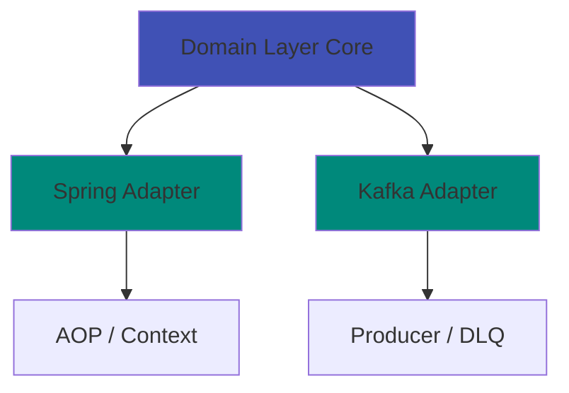
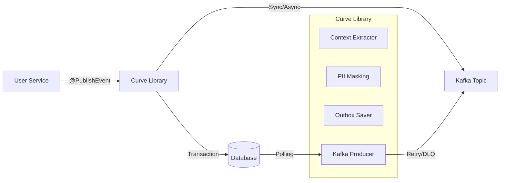

<div align="center">

# Curve

**Declarative Event Publishing Library for Spring Boot Microservices**

[](https://openjdk.java.net/)
[](https://spring.io/projects/spring-boot)
[](https://kafka.apache.org/)
[](LICENSE)
[](https://github.com/closeup1202/curve/actions)
[](https://codecov.io/gh/closeup1202/curve)
[](https://sonarcloud.io/project/overview?id=closeup1202_curve)

[English](README.md) | [한국어](README.ko.md)

</div>

---

## Project Stats


---

## Quick Demo

```java
// Just add one annotation!
@PublishEvent(eventType = "USER_CREATED")
public User createUser(CreateUserRequest request) {
    return userRepository.save(new User(request));
}
```

**→ Automatically publishes to Kafka + PII masking + DLQ on failure + Metrics collection** ✨

<!-- Add demo GIF here:  -->

---

## Why Curve?

<table>
<tr>
<td width="50%">

### Before (Legacy)
```java
// 50+ lines of boilerplate code
@Service
public class UserService {

    @Autowired
    private KafkaTemplate<String, Object> kafka;

    @Autowired
    private ObjectMapper objectMapper;

    public User createUser(UserRequest request) {
        User user = userRepository.save(
            new User(request)
        );

        try {
            // Manual event creation
            EventEnvelope event = EventEnvelope.builder()
                .eventId(UUID.randomUUID().toString())
                .eventType("USER_CREATED")
                .occurredAt(Instant.now())
                .publishedAt(Instant.now())
                .metadata(/* ... */)
                .payload(/* ... */)
                .build();

            // Manual PII masking
            String json = maskPii(
                objectMapper.writeValueAsString(event)
            );

            // Manual Kafka send with retry
            kafka.send("user-events", json)
                .get(30, TimeUnit.SECONDS);

        } catch (Exception e) {
            // Manual error handling
            log.error("Failed to publish event", e);
            sendToDlq(event);
        }

        return user;
    }
}
```

</td>
<td width="50%">

### After (Curve)
```java
// Just 1 annotation!
@Service
public class UserService {

    @PublishEvent(eventType = "USER_CREATED")
    public User createUser(UserRequest request) {
        return userRepository.save(
            new User(request)
        );
    }
}
```

**90% less code**

Everything handled automatically:
- ✅ Event ID generation
- ✅ Metadata extraction
- ✅ PII masking
- ✅ Kafka publishing
- ✅ Retry & DLQ
- ✅ Metrics collection

</td>
</tr>
</table>

---

## Key Features

### Declarative Event Publishing
No more Kafka boilerplate - just add `@PublishEvent` annotation. Supports SpEL for flexible payload extraction.

### Standardized Event Structure
All events follow a unified schema with metadata (source, actor, trace, tags).

### 3-Tier Failure Recovery
**Main Topic → DLQ → Local File Backup**
Zero event loss even when Kafka is down for 24 hours.

### Automatic PII Protection
`@PiiField` annotation automatically masks/encrypts sensitive data. Supports **AWS KMS** and **HashiCorp Vault** for key management.

### High Performance
- **Sync mode**: ~500 TPS
- **Async mode**: ~10,000+ TPS (with MDC Context Propagation)
- **Transactional Outbox**: Guarantees atomicity and consistency.

### Hexagonal Architecture
Framework-independent core for maximum flexibility.

### Built-in Observability
- Spring Actuator Health Indicator
- Custom metrics endpoint (`/actuator/curve-metrics`)
- Detailed event tracking
- **Async Context Propagation**: MDC (Trace ID) is preserved even in async threads.

### Testability
- Provides `MockEventProducer` for easy unit/integration testing without Kafka.

---

## Quick Start

### 1. Add Dependency

**Gradle (build.gradle)**
```gradle
dependencies {
    implementation 'io.github.closeup1202:curve:0.0.5'
}
```

**Maven (pom.xml)**
```xml
<dependency>
    <groupId>io.github.closeup1202</groupId>
    <artifactId>curve</artifactId>
    <version>0.0.5</version>
</dependency>
```

### 2. Configure

**application.yml**
```yaml
spring:
  kafka:
    bootstrap-servers: localhost:9092

curve:
  enabled: true
  kafka:
    topic: event.audit.v1
    dlq-topic: event.audit.dlq.v1
```

### 3. Use

```java
import io.github.closeup1202.curve.spring.audit.annotation.PublishEvent;
import io.github.closeup1202.curve.core.type.EventSeverity;

@Service
public class OrderService {

    @PublishEvent(
        eventType = "ORDER_CREATED",
        severity = EventSeverity.INFO
    )
    public Order createOrder(OrderRequest request) {
        // Your business logic
        return orderRepository.save(new Order(request));
    }
}
```

### 4. Run Local Kafka

```bash
docker-compose up -d
```

### 5. Verify

- **Kafka UI**: http://localhost:8080
- **Health Check**: http://localhost:8081/actuator/health/curve
- **Metrics**: http://localhost:8081/actuator/curve-metrics

Done! 🎉

---

## Comparison

| Feature | Spring Events | Spring Cloud Stream | Curve |
|---------|--------------|---------------------|-------|
| Kafka Integration | ❌ | ✅ | ✅ |
| Declarative Usage | ✅ | △ | ✅ |
| Standardized Schema | ❌ | ❌ | ✅ |
| PII Protection | ❌ | ❌ | ✅ |
| KMS Integration | ❌ | ❌ | ✅ |
| DLQ Support | ❌ | ✅ | ✅ |
| Local File Backup | ❌ | ❌ | ✅ |
| Health Check | ❌ | ❌ | ✅ |
| Custom Metrics | ❌ | ❌ | ✅ |
| Snowflake ID | ❌ | ❌ | ✅ |
| Transactional Outbox | ❌ | ❌ | ✅ |
| **Boilerplate Code** | **Medium** | **High** | **Minimal** |

---

## Architecture

### Hexagonal Architecture (Ports & Adapters)



### System Context



### Module Structure

```
curve/
├── core/                          # Pure domain model (framework-independent)
│   ├── envelope/                  # EventEnvelope, EventMetadata
│   ├── port/                      # EventProducer, IdGenerator (interfaces)
│   ├── context/                   # ContextProvider (interfaces)
│   ├── validation/                # EventValidator
│   └── exception/                 # Domain exceptions
│
├── spring/                        # Spring Framework adapter
│   ├── aop/                       # @PublishEvent Aspect
│   ├── context/                   # Spring-based Context Provider implementations
│   ├── factory/                   # EventEnvelopeFactory
│   ├── infrastructure/            # SnowflakeIdGenerator, UtcClockProvider
│   ├── publisher/                 # AbstractEventPublisher
│   └── test/                      # Test utilities (MockEventProducer)
│
├── kafka/                         # Kafka adapter
│   ├── producer/                  # KafkaEventProducer
│   └── dlq/                       # FailedEventRecord
│
├── kms/                           # KMS adapter
│   ├── provider/                  # AwsKmsProvider, VaultKeyProvider
│   └── autoconfigure/             # KMS auto-configuration
│
└── spring-boot-autoconfigure/     # Spring Boot auto-configuration
    ├── CurveAutoConfiguration     # Main configuration
    ├── CurveProperties            # Configuration properties
    └── health/                    # Health indicator & metrics
```

### Core Design Principles

1. **Dependency Inversion Principle (DIP)**
   - Core module has zero framework dependencies
   - External dependencies isolated via Port interfaces

2. **Single Responsibility Principle (SRP)**
   - Each ContextProvider handles one responsibility
   - EventValidator validates, EventProducer publishes

3. **Open/Closed Principle (OCP)**
   - EventProducer interface allows non-Kafka brokers
   - ContextProvider implementations are replaceable

---

## Use Cases

### 1. Audit Logging
```java
@PublishEvent(eventType = "USER_LOGIN", severity = INFO)
public User login(String username, String password) {
    return authService.authenticate(username, password);
}
```

### 2. Event-Driven Architecture
```java
@PublishEvent(eventType = "ORDER_COMPLETED")
public Order completeOrder(Long orderId) {
    Order order = orderRepository.findById(orderId);
    order.setStatus(OrderStatus.COMPLETED);
    return orderRepository.save(order);
}
```

### 3. Data Pipeline
```java
@PublishEvent(eventType = "CUSTOMER_REGISTERED")
public Customer registerCustomer(CustomerRequest request) {
    // Event automatically flows to data lake/warehouse
    return customerRepository.save(new Customer(request));
}
```

---

## Security Features

### Automatic PII Protection

```java
public class UserEventPayload implements DomainEventPayload {

    @PiiField(type = PiiType.EMAIL, strategy = PiiStrategy.MASK)
    private String email;  // "user@example.com" → "user@***.com"

    @PiiField(type = PiiType.PHONE, strategy = PiiStrategy.ENCRYPT)
    private String phone;  // Encrypted with AES-256-GCM

    @PiiField(type = PiiType.NAME, strategy = PiiStrategy.HASH)
    private String name;   // HMAC-SHA256 hashed
}
```

**Supported Strategies:**
- **MASK**: Pattern-based masking (e.g., `j***@gm***.com`)
- **ENCRYPT**: AES-256-GCM encryption (reversible, Base64-encoded 32-byte key required)
- **HASH**: HMAC-SHA256 hashing (irreversible, salt recommended)

**KMS Support:**
- **AWS KMS**: Envelope encryption with DEK caching
- **HashiCorp Vault**: Centralized key management

**Configuration:**
```yaml
curve:
  pii:
    enabled: true
    kms:
      enabled: true
      type: aws  # or vault
      aws:
        region: us-east-1
        default-key-arn: arn:aws:kms:us-east-1:123456789012:key/uuid
```

---

## Observability

### Health Check

```bash
curl http://localhost:8081/actuator/health/curve
```

**Response:**
```json
{
  "status": "UP",
  "details": {
    "kafkaProducerInitialized": true,
    "clusterId": "lkc-abc123",
    "nodeCount": 3,
    "topic": "event.audit.v1",
    "dlqTopic": "event.audit.dlq.v1"
  }
}
```

### Custom Metrics Endpoint

```bash
curl http://localhost:8081/actuator/curve-metrics
```

**Response:**
```json
{
  "summary": {
    "totalEventsPublished": 1523,
    "successfulEvents": 1520,
    "failedEvents": 3,
    "successRate": "99.80%",
    "totalDlqEvents": 3,
    "totalKafkaErrors": 0
  },
  "events": {
    "published": [...],
    "publishDuration": [...]
  },
  "dlq": {...},
  "kafka": {...}
}
```

---

## Configuration

### Full Configuration Example

```yaml
curve:
  enabled: true

  id-generator:
    worker-id: 1  # 0-1023, unique per instance
    auto-generate: false

  async:
    enabled: false  # Enable dedicated async executor
    core-pool-size: 2
    max-pool-size: 10
    queue-capacity: 500

  kafka:
    topic: event.audit.v1
    dlq-topic: event.audit.dlq.v1
    retries: 3
    retry-backoff-ms: 1000
    request-timeout-ms: 30000
    sync-timeout-seconds: 30
    async-mode: false  # true for high throughput
    async-timeout-ms: 5000

  retry:
    enabled: true
    max-attempts: 3
    initial-interval: 1000
    multiplier: 2.0
    max-interval: 10000

  security:
    use-forwarded-headers: false  # true when behind proxy

  pii:
    enabled: true
    crypto:
      default-key: ${PII_ENCRYPTION_KEY}  # Base64-encoded 32-byte AES-256 key
      salt: ${PII_HASH_SALT}
    kms:
      enabled: false  # Set to true to use KMS
      type: aws  # aws or vault

  outbox:
    enabled: true
    publisher-enabled: true  # false for CDC-based publishing
    poll-interval-ms: 1000
    batch-size: 100
    max-retries: 3
    send-timeout-seconds: 10
    dynamic-batching-enabled: true
    circuit-breaker-enabled: true
    cleanup-enabled: true
    retention-days: 7
    cleanup-cron: "0 0 2 * * *"

  serde:
    type: JSON  # JSON, AVRO, PROTOBUF
    # schema-registry-url: http://localhost:8081  # Required when type is AVRO
```

### Avro Serialization (Optional)

If you want to use Avro serialization (`serde.type: AVRO`), add these dependencies:

**build.gradle:**
```groovy
repositories {
    mavenCentral()
    maven { url 'https://packages.confluent.io/maven/' }
}

dependencies {
    implementation 'org.apache.avro:avro:1.11.4'
    implementation 'io.confluent:kafka-avro-serializer:7.5.0'
}
```

> **Note**: JSON serialization works out of the box without additional dependencies.

### Environment-Specific Profiles

**Development:**
```yaml
spring:
  config:
    activate:
      on-profile: dev

curve:
  kafka:
    async-mode: true  # Fast iteration
    topic: event.audit.dev.v1
```

**Production:**
```yaml
spring:
  config:
    activate:
      on-profile: prod

curve:
  id-generator:
    worker-id: ${POD_ORDINAL}  # Kubernetes StatefulSet
  kafka:
    async-mode: false  # Reliability first
    retries: 5
```

See [Configuration Guide](docs/CONFIGURATION.md) for details.

---

## Advanced Features

### 1. Snowflake ID Generator

Distributed unique ID generation without collisions.

**Structure:**
```
| 42 bits: Timestamp | 10 bits: Worker ID | 12 bits: Sequence |
```

**Capacity:**
- Up to **1,024 workers**
- **4,096 IDs per millisecond** per worker
- **Time-sortable**

### 2. Transactional Outbox Pattern

Guarantees atomicity between DB transactions and event publishing.

- **Exponential Backoff**: Automatically retries failed events with increasing delays (1s, 2s, 4s...) to reduce DB load.
- **SKIP LOCKED**: Uses pessimistic locking to prevent duplicate processing in multi-instance environments.

```java
@Transactional
@PublishEvent(
    eventType = "ORDER_CREATED",
    outbox = true,
    aggregateType = "Order",
    aggregateId = "#result.orderId"
)
public Order createOrder(OrderRequest req) {
    return orderRepo.save(new Order(req));
}
```

### 3. Flexible Payload Extraction (SpEL)

Extract specific data for the event payload using SpEL.

```java
@PublishEvent(
    eventType = "USER_UPDATED",
    payload = "#args[0].toEventDto()"
)
public User updateUser(UserUpdateRequest request) {
    // ...
}
```

### 4. Custom Event Producer

Implement `EventProducer` interface for non-Kafka brokers:

```java
@Component
public class RabbitMqEventProducer extends AbstractEventPublisher {

    private final RabbitTemplate rabbitTemplate;

    @Override
    protected <T extends DomainEventPayload> void send(EventEnvelope<T> envelope) {
        String json = objectMapper.writeValueAsString(envelope);
        rabbitTemplate.convertAndSend(exchange, routingKey, json);
    }
}
```

### 5. DLQ Recovery

```bash
# List backup files
./scripts/dlq-recovery.sh --list

# Recover all files
./scripts/dlq-recovery.sh --topic event.audit.v1 --broker localhost:9092

# Recover specific file
./scripts/dlq-recovery.sh --file 1234567890.json --topic event.audit.v1
```

---

## Roadmap

### v0.1.0 (Q2 2026)
- [ ] Performance benchmarks & optimization guide
- [ ] GraphQL subscription support
- [ ] AWS EventBridge adapter
- [ ] Grafana dashboard template
- [ ] More PII type presets (SSN, Credit Card, etc.)

### v1.0.0 (Q3 2026)
- [ ] Production-ready release
- [ ] Spring Cloud Stream binder
- [ ] Avro schema evolution support
- [ ] gRPC event streaming
- [ ] Multi-cloud KMS support (GCP, Azure)

**Have ideas?** Vote for features or suggest new ones in [GitHub Discussions](https://github.com/closeup1202/curve/discussions) 💡

---

## Documentation

| Document | Description |
|----------|-------------|
| [Configuration Guide](docs/CONFIGURATION.md) | Detailed configuration options |
| [Operations Guide](docs/OPERATIONS.md) | Production operations and best practices |
| [Troubleshooting](docs/TROUBLESHOOTING.md) | Common issues and solutions |
| [Monitoring Guide](docs/MONITORING.md) | Metrics, dashboards, and alerting |
| [Migration Guide](docs/MIGRATION.md) | Version upgrade instructions |
| [Changelog](docs/CHANGELOG.md) | Version history and changes |
| [Example Configuration](application.example.yml) | Configuration examples |
| [Sample Application](sample/) | Full working example

---

## Community & Support

Join the Curve community:

- 💬 **[GitHub Discussions](https://github.com/closeup1202/curve/discussions)** - Ask questions, share ideas, get help
- 🐛 **[Issues](https://github.com/closeup1202/curve/issues)** - Report bugs, request features
- 🤝 **[Contributing](docs/community/contributing.md)** - Contribution guidelines

**Using Curve in production?** We'd love to hear your story! Share it in [Discussions](https://github.com/closeup1202/curve/discussions) and get featured here 🌟

---

## Contributing

Contributions are welcome! Please feel free to submit a Pull Request.

See [CONTRIBUTING.md](docs/community/contributing.md) for guidelines.

---

## License

This project is licensed under the MIT License - see the [LICENSE](LICENSE) file for details.

---

## Acknowledgments

- Inspired by **Spring Cloud Stream** and **Spring Kafka**
- Built with **Spring Boot** and **Apache Kafka**
- Hexagonal Architecture pattern from **Alistair Cockburn**

---

## Contact

- **Issues**: [GitHub Issues](https://github.com/closeup1202/curve/issues)
- **Email**: closeup1202@gmail.com

---

<div align="center">

[⬆ Back to top](#curve)

</div>
