# Failure Recovery

Curve provides 3-tier failure recovery to ensure **zero event loss**, even when Kafka is down.

## Overview

```mermaid
graph LR
    A[Event] --> B{Publish to Main Topic}
    B -->|Success| C[Done ✓]
    B -->|Failure| D{Publish to DLQ}
    D -->|Success| E[DLQ ✓]
    D -->|Failure| F{Backup Strategy}
    F -->|S3| G[S3 Bucket ☁️]
    F -->|Local| H[Local File 💾]

    style C fill:#00897b
    style E fill:#ff9800
    style G fill:#2196f3
    style H fill:#f44336
```



### Tiers

1. **Main Topic** - Primary Kafka topic for events
2. **DLQ (Dead Letter Queue)** - Fallback topic for failed events
3. **Backup Strategy** - Last resort when Kafka is unavailable (S3 or Local File)

---

## Configuration

```yaml title="application.yml"
curve:
  kafka:
    topic: event.audit.v1
    dlq-topic: event.audit.dlq.v1  # DLQ topic

    # Backup Strategy Configuration
    backup:
      s3-enabled: true             # Enable S3 backup
      s3-bucket: "my-event-backup" # S3 Bucket name
      s3-prefix: "dlq-backup"      # S3 Key prefix
      local-enabled: true          # Enable local file backup as fallback

  retry:
    enabled: true
    max-attempts: 3           # Retry 3 times
    initial-interval: 1000    # 1 second
    multiplier: 2.0           # Exponential backoff
    max-interval: 10000       # Max 10 seconds
```

---

## Tier 1: Main Topic

Normal event publishing to the primary Kafka topic.

```java
@PublishEvent(eventType = "ORDER_CREATED")
public Order createOrder(OrderRequest request) {
    return orderRepository.save(new Order(request));
}
```

**Retry behavior:**

- Attempt 1: Immediate
- Attempt 2: Wait 1 second
- Attempt 3: Wait 2 seconds (1s × 2.0)
- Attempt 4: Wait 4 seconds (2s × 2.0)

If all attempts fail → Move to Tier 2 (DLQ)

---

## Tier 2: Dead Letter Queue (DLQ)

Failed events are sent to a separate DLQ topic for analysis and reprocessing.

### DLQ Event Structure

```json
{
  "eventId": "7355889748156289024",
  "originalTopic": "event.audit.v1",
  "failureReason": "Kafka broker not available",
  "failureTimestamp": "2026-02-03T10:30:00Z",
  "retryCount": 3,
  "originalEvent": {
    "eventType": "ORDER_CREATED",
    "payload": { ... }
  }
}
```

### Monitoring DLQ

#### 1. Kafka Console Consumer

```bash
kafka-console-consumer --bootstrap-server localhost:9094 \
    --topic event.audit.dlq.v1 --from-beginning
```

#### 2. Kafka UI

Access Kafka UI at http://localhost:8080 and navigate to the DLQ topic.

#### 3. Spring Boot Actuator

```bash
curl http://localhost:8080/actuator/curve-metrics
```

```json
{
  "dlq": {
    "totalDlqEvents": 5,
    "recentDlqEvents": [
      {
        "eventType": "ORDER_CREATED",
        "failureReason": "Timeout",
        "timestamp": "2026-02-03T10:30:00Z"
      }
    ]
  }
}
```

---

## Tier 3: Backup Strategies

If Kafka is completely unavailable (broker down, network issue), events are saved using configured backup strategies.

### 1. S3 Backup (Recommended for Cloud/K8s)

Stores failed events in AWS S3 or MinIO. Ideal for containerized environments where local storage is ephemeral.

**Requirements:**
- `software.amazon.awssdk:s3` dependency
- `S3Client` bean configured in Spring Context

**S3 Key Structure:**
`prefix/yyyy/MM/dd/{eventId}.json`

### 2. Local File Backup

Stores failed events to the local file system. Useful for bare-metal servers or development environments.

**Backup Location:**
```
/tmp/curve-backup/
  └── failed-events/
      ├── 1738587000000.json
      ├── 1738587001000.json
      └── 1738587002000.json
```

**Security:**
- POSIX systems: Files created with `600` permissions (rw-------)
- Windows: ACL restricted to current user only

### Backup File Format

```json title="1738587000000.json"
{
  "eventId": "7355889748156289024",
  "eventType": "ORDER_CREATED",
  "occurredAt": "2026-02-03T10:30:00Z",
  "backupReason": "Kafka broker unavailable",
  "backupTimestamp": "2026-02-03T10:30:00.500Z",
  "payload": { ... }
}
```

---

## Recovery Process

### 1. Manual Recovery with Script

Curve provides a recovery script for republishing backed-up events:

```bash title="scripts/dlq-recovery.sh"
#!/bin/bash

# List backup files
./scripts/dlq-recovery.sh --list

# Recover all files
./scripts/dlq-recovery.sh \
    --topic event.audit.v1 \
    --broker localhost:9094

# Recover specific file
./scripts/dlq-recovery.sh \
    --file /tmp/curve-backup/failed-events/1738587000000.json \
    --topic event.audit.v1 \
    --broker localhost:9094
```

### 2. Automated Recovery (Future Feature)

Planned for v0.1.0:

- Automatic retry from S3/Local backup when Kafka recovers
- Configurable recovery schedule
- Recovery metrics and alerts

---

## Monitoring and Alerts

### Health Check

```bash
curl http://localhost:8080/actuator/health/curve
```

```json
{
  "status": "UP",
  "details": {
    "kafkaProducerInitialized": true,
    "dlqEnabled": true,
    "backupStrategy": "CompositeBackupStrategy(S3, Local)",
    "s3BackupEnabled": true,
    "localBackupEnabled": true
  }
}
```

### Metrics

```bash
curl http://localhost:8080/actuator/curve-metrics
```

```json
{
  "summary": {
    "totalEventsPublished": 1523,
    "successfulEvents": 1520,
    "failedEvents": 3,
    "successRate": "99.80%",
    "totalDlqEvents": 3,
    "totalBackupFiles": 0
  }
}
```

### Alerts

Set up alerts for:

- DLQ event count > threshold
- Backup file count > 0
- Success rate < 99%

**Example with Prometheus:**

```yaml
- alert: HighDLQEventCount
  expr: curve_dlq_events_total > 10
  for: 5m
  annotations:
    summary: "High DLQ event count detected"
```

---

## Best Practices

### :white_check_mark: DO

- **Use S3 Backup in K8s** - Local files are lost on pod restart
- **Monitor DLQ regularly** - Set up alerts for DLQ events
- **Investigate failures** - Analyze failure reasons
- **Test recovery** - Practice recovery procedures
- **Set up alerts** - Notify on backup file creation
- **Regular cleanup** - Archive old backup files

### :x: DON'T

- Ignore DLQ events - they indicate issues
- Disable backup in production
- Store backups on ephemeral storage without S3 backup
- Delete backup files without analysis

---

## Production Recommendations

### 1. S3 Backup for Kubernetes

Configure S3 backup to ensure data persistence across pod restarts:

```yaml
curve:
  kafka:
    backup:
      s3-enabled: true
      s3-bucket: "prod-event-backups"
      local-enabled: false # Optional: disable local backup if S3 is reliable
```

### 2. Separate DLQ Consumer

Create a dedicated consumer for DLQ analysis:

```java
@KafkaListener(topics = "event.audit.dlq.v1")
public void handleDlqEvent(DlqEvent event) {
    log.error("DLQ Event: {} - Reason: {}",
        event.getEventType(),
        event.getFailureReason()
    );

    // Send alert
    alertService.sendAlert(event);

    // Store for analysis
    dlqRepository.save(event);
}
```

### 3. Automated Recovery Job

Run periodic recovery job:

```java
@Scheduled(fixedDelay = 3600000) // Every hour
public void recoverBackupFiles() {
    List<File> backups = backupService.listBackupFiles();

    for (File backup : backups) {
        try {
            eventProducer.republish(backup);
            backup.delete();
        } catch (Exception e) {
            log.error("Recovery failed for {}", backup, e);
        }
    }
}
```

---

## Troubleshooting

### DLQ Events Not Created

!!! failure "Events failing but no DLQ events"

    **Check:**

    1. `curve.kafka.dlq-topic` is configured
    2. DLQ topic exists in Kafka
    3. Kafka is accessible

### Backup Files Accumulating

!!! failure "Many backup files created"

    **Possible causes:**

    - Kafka broker down
    - Network issues
    - Authentication failure

    **Solution:**

    1. Check Kafka health: `docker-compose ps`
    2. Verify bootstrap servers
    3. Check Kafka logs

---

## What's Next?

<div class="grid cards" markdown>

-   :material-database:{ .lg .middle } **Transactional Outbox**

    ---

    Guarantee atomicity

    [:octicons-arrow-right-24: Outbox Pattern](transactional-outbox.md)

-   :material-chart-line:{ .lg .middle } **Observability**

    ---

    Monitor your events

    [:octicons-arrow-right-24: Observability](observability.md)

</div>
