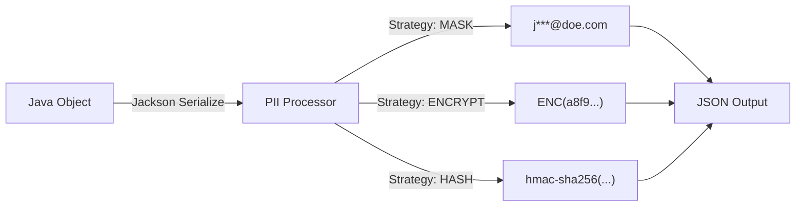

# PII Protection

Curve provides automatic PII (Personally Identifiable Information) protection with declarative annotations.

## Quick Start

```java
import io.github.closeup1202.curve.spring.pii.annotation.PiiField;
import io.github.closeup1202.curve.spring.pii.type.PiiType;
import io.github.closeup1202.curve.spring.pii.strategy.PiiStrategy;

public class UserPayload implements DomainEventPayload {

    @PiiField(type = PiiType.EMAIL, strategy = PiiStrategy.MASK)
    private String email;  // "user@example.com" → "u***@ex***.com"

    @PiiField(type = PiiType.PHONE, strategy = PiiStrategy.ENCRYPT)
    private String phone;  // "+1234567890" → "AES-encrypted"

    @PiiField(type = PiiType.NAME, strategy = PiiStrategy.HASH)
    private String name;   // "John Doe" → "5a4b3c2d..."
}
```

## How It Works



**Process:**

1. **Serialization Interception**: Curve intercepts Jackson serialization process.
2. **Annotation Detection**: Scans for `@PiiField` annotations on fields.
3. **Strategy Execution**: Applies the configured strategy (MASK, ENCRYPT, HASH).
4. **Output Generation**: Replaces the original value with the protected value in the JSON output.

---

## Protection Strategies

### 1. MASK - Pattern-Based Masking

Partially hides data while keeping it recognizable.

```java
@PiiField(type = PiiType.EMAIL, strategy = PiiStrategy.MASK)
private String email;
```

**Examples:**

| PII Type | Original | Masked |
|----------|----------|--------|
| EMAIL | `john.doe@example.com` | `j***@ex***.com` |
| PHONE | `+1-555-123-4567` | `+1-***-***-4567` |
| SSN | `123-45-6789` | `***-**-6789` |
| NAME | `John Michael Doe` | `J*** M*** D***` |
| ADDRESS | `123 Main St, City` | `*** Main St, ***` |
| CREDIT_CARD | `1234-5678-9012-3456` | `****-****-****-3456` |

**When to use:**

- Logs and audit trails
- Customer support dashboards
- Non-production environments

---

### 2. ENCRYPT - Reversible Encryption

AES-256-GCM encryption for reversible protection.

```java
@PiiField(type = PiiType.PHONE, strategy = PiiStrategy.ENCRYPT)
private String phone;
```

**Output:**

```
Original: +1-555-123-4567
Encrypted: AQIDAHj8...9f3a2b1c0 (Base64-encoded)
```

**When to use:**

- Data that needs to be decrypted later
- Cross-service communication
- Secure storage

**Configuration:**

```yaml
curve:
  pii:
    enabled: true
    crypto:
      default-key: ${PII_ENCRYPTION_KEY}  # Base64-encoded 32-byte key
```

!!! warning "Key Management"
    Store encryption keys in secure vaults (AWS Secrets Manager, HashiCorp Vault, etc.)

---

### 3. HASH - Irreversible Hashing

HMAC-SHA256 hashing for one-way protection with salt-based keyed hashing.

```java
@PiiField(type = PiiType.NAME, strategy = PiiStrategy.HASH)
private String name;
```

**Output:**

```
Original: John Doe
Hashed: 5a4b3c2d1e0f9a8b7c6d5e4f3a2b1c0d...
```

**When to use:**

- Analytics and aggregation
- Deduplication
- Data that should never be reversed

**Configuration:**

```yaml
curve:
  pii:
    crypto:
      salt: ${PII_HASH_SALT}  # Add salt for security
```

---

## Supported PII Types

| PII Type | Description | Example |
|----------|-------------|---------|
| `EMAIL` | Email addresses | john@example.com |
| `PHONE` | Phone numbers | +1-555-123-4567 |
| `SSN` | Social Security Numbers | 123-45-6789 |
| `NAME` | Full names | John Doe |
| `ADDRESS` | Physical addresses | 123 Main St |
| `CREDIT_CARD` | Credit card numbers | 1234-5678-9012-3456 |
| `IP_ADDRESS` | IP addresses | 192.168.1.1 |
| `GENERIC` | Custom sensitive data | Any string |

---

## Configuration

### Enable PII Protection

```yaml title="application.yml"
curve:
  pii:
    enabled: true  # Default: true

    crypto:
      # AES-256 encryption key (Base64-encoded 32-byte key)
      default-key: ${PII_ENCRYPTION_KEY}

      # Salt for hashing (recommended)
      salt: ${PII_HASH_SALT}
```

### Environment Variables

```bash title=".env"
PII_ENCRYPTION_KEY=K7gNU3sdo+OL0wNhqoVWhr3g6s1xYv72ol/pe/Unols=  # Base64-encoded 32-byte key
PII_HASH_SALT=random-salt-for-hashing-123
```

---

## KMS Integration

Curve supports external Key Management Services for enterprise-grade encryption key management.

### AWS KMS (Envelope Encryption)

```yaml title="application.yml"
curve:
  pii:
    enabled: true
    kms:
      enabled: true
      type: aws

# KMS module configuration
curve-kms:
  aws:
    key-id: "arn:aws:kms:us-east-1:123456789:key/abc-123"
    region: us-east-1
    cache-ttl-minutes: 60
    cache-max-size: 100
```

**How it works:**

1. AWS KMS generates a Data Encryption Key (DEK)
2. DEK encrypts the PII data locally (AES-256-GCM)
3. Encrypted DEK is stored alongside the ciphertext
4. Decryption requests KMS to decrypt the DEK first

### HashiCorp Vault (Static Key)

```yaml title="application.yml"
curve:
  pii:
    enabled: true
    kms:
      enabled: true
      type: vault

# KMS module configuration
curve-kms:
  vault:
    path: "secret/data/curve/encryption-key"
    key-field: "key"
```

**How it works:**

1. Curve fetches the encryption key from Vault K/V secret engine
2. Key is used for local AES-256-GCM encryption
3. Key rotation is handled by updating the Vault secret

---

## Advanced Usage

### Custom Masking Patterns

Create custom masking logic:

```java
public class CustomMaskingStrategy implements PiiMaskingStrategy {

    @Override
    public String mask(String value, PiiType type) {
        // Custom masking logic
        return maskCustom(value);
    }
}
```

Register as Spring bean:

```java
@Configuration
public class PiiConfig {

    @Bean
    public PiiMaskingStrategy customMaskingStrategy() {
        return new CustomMaskingStrategy();
    }
}
```

### Conditional Protection

Protect fields conditionally based on environment:

```java
public class UserPayload {

    @PiiField(
        type = PiiType.EMAIL,
        strategy = PiiStrategy.MASK,
        condition = "#{environment.getProperty('app.environment') == 'prod'}"
    )
    private String email;
}
```

---

## Best Practices

### :white_check_mark: DO

- **Use MASK for logs** - Keeps data recognizable for debugging
- **Use ENCRYPT for storage** - Allows decryption when needed
- **Use HASH for analytics** - Irreversible for aggregation
- **Rotate keys regularly** - Update encryption keys periodically
- **Store keys securely** - Use secret management services

### :x: DON'T

- Store encryption keys in source code
- Use HASH when you need to decrypt later
- Over-mask data (e.g., masking non-sensitive fields)
- Use weak keys (must be exactly 32 bytes, Base64-encoded)

---

## Compliance

Curve's PII protection helps with:

- **GDPR** (General Data Protection Regulation)
- **CCPA** (California Consumer Privacy Act)
- **HIPAA** (Health Insurance Portability and Accountability Act)
- **PCI DSS** (Payment Card Industry Data Security Standard)

!!! note "Legal Disclaimer"
    Curve provides tools for PII protection, but compliance is the responsibility of the application owner.

---

## Examples

### Complete User Event

```java
public class UserRegisteredPayload implements DomainEventPayload {

    private Long userId;
    private String username;  // Not sensitive

    @PiiField(type = PiiType.EMAIL, strategy = PiiStrategy.MASK)
    private String email;

    @PiiField(type = PiiType.PHONE, strategy = PiiStrategy.ENCRYPT)
    private String phone;

    @PiiField(type = PiiType.NAME, strategy = PiiStrategy.HASH)
    private String firstName;

    @PiiField(type = PiiType.NAME, strategy = PiiStrategy.HASH)
    private String lastName;

    @PiiField(type = PiiType.ADDRESS, strategy = PiiStrategy.MASK)
    private String address;

    @PiiField(type = PiiType.IP_ADDRESS, strategy = PiiStrategy.HASH)
    private String lastLoginIp;

    private Instant createdAt;
}
```

**Published Event:**

```json
{
  "userId": 12345,
  "username": "john_doe",
  "email": "j***@ex***.com",
  "phone": "AQIDAHj8...9f3a2b1c0",
  "firstName": "5a4b3c2d...",
  "lastName": "7f8e9d1a...",
  "address": "*** Main St, ***",
  "lastLoginIp": "8f7e6d5c...",
  "createdAt": "2026-02-03T10:30:00Z"
}
```

---

## What's Next?

<div class="grid cards" markdown>

-   :material-shield-alert:{ .lg .middle } **Failure Recovery**

    ---

    Handle failures with DLQ

    [:octicons-arrow-right-24: Failure Recovery](failure-recovery.md)

-   :material-database:{ .lg .middle } **Transactional Outbox**

    ---

    Guarantee event delivery

    [:octicons-arrow-right-24: Outbox Pattern](transactional-outbox.md)

</div>
