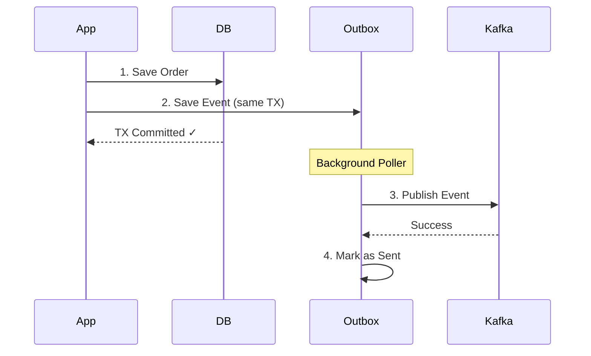

# Transactional Outbox Pattern

Guarantee atomicity between database transactions and event publishing with Curve's transactional outbox pattern.

## The Problem

Without transactional outbox:

```java
@Transactional
public Order createOrder(OrderRequest request) {
    // 1. Save to database
    Order order = orderRepository.save(new Order(request));

    // 2. Publish to Kafka
    kafkaProducer.send("orders", orderEvent);  // ❌ What if this fails?

    return order;
}
```

**Issues:**

- Order saved but event not published → Lost event
- Event published but transaction rolled back → Ghost event
- No atomicity between DB and Kafka

---

## The Solution

Transactional outbox saves events to the database in the same transaction:

```java
@Transactional
@PublishEvent(
    eventType = "ORDER_CREATED",
    outbox = true,                    // ✓ Enable outbox
    aggregateType = "Order",          // Entity type
    aggregateId = "#result.id"        // Entity ID
)
public Order createOrder(OrderRequest request) {
    return orderRepository.save(new Order(request));
}
```

---

## How It Works



**Steps:**

1. **Save entity and event in same transaction** - Atomicity guaranteed
2. **Background poller** - Periodically checks for unsent events
3. **Publish to Kafka** - Events sent asynchronously
4. **Mark as sent** - Successful events marked complete

---

## Configuration

### Enable Outbox

```yaml title="application.yml"
spring:
  datasource:
    url: jdbc:postgresql://localhost:5432/mydb
    username: user
    password: pass

  jpa:
    hibernate:
      ddl-auto: update  # Or use Flyway/Liquibase

curve:
  outbox:
    enabled: true
    poll-interval-ms: 1000      # Poll every 1 second
    batch-size: 100             # Process 100 events per batch
    max-retries: 3              # Retry failed events 3 times
    cleanup-enabled: true       # Auto-cleanup old events
    retention-days: 7           # Keep events for 7 days
    cleanup-cron: "0 0 2 * * *" # Cleanup at 2 AM daily
```

### Database Schema

Curve auto-creates the outbox table:

```sql
CREATE TABLE curve_outbox_events (
    id BIGINT PRIMARY KEY,
    event_id VARCHAR(255) NOT NULL,
    event_type VARCHAR(255) NOT NULL,
    aggregate_type VARCHAR(255) NOT NULL,
    aggregate_id VARCHAR(255) NOT NULL,
    payload TEXT NOT NULL,
    metadata TEXT,
    status VARCHAR(50) NOT NULL,  -- PENDING, SENT, FAILED
    retry_count INT DEFAULT 0,
    last_retry_at TIMESTAMP,
    created_at TIMESTAMP NOT NULL,
    sent_at TIMESTAMP,
    error_message TEXT
);

CREATE INDEX idx_status ON curve_outbox_events(status);
CREATE INDEX idx_created_at ON curve_outbox_events(created_at);
```

---

## Usage Examples

### Basic Outbox

```java
@Transactional
@PublishEvent(
    eventType = "ORDER_CREATED",
    outbox = true,
    aggregateType = "Order",
    aggregateId = "#result.id"
)
public Order createOrder(OrderRequest request) {
    return orderRepository.save(new Order(request));
}
```

### With Custom Payload

```java
@Transactional
@PublishEvent(
    eventType = "USER_REGISTERED",
    outbox = true,
    aggregateType = "User",
    aggregateId = "#result.userId",
    payload = "new UserRegisteredPayload(#result)"
)
public User registerUser(UserRequest request) {
    User user = userRepository.save(new User(request));

    // Other operations in same transaction
    auditRepository.save(new AuditLog("User registered"));

    return user;
}
```

### Complex Transaction

```java
@Transactional
@PublishEvent(
    eventType = "ORDER_COMPLETED",
    outbox = true,
    aggregateType = "Order",
    aggregateId = "#result.id"
)
public Order completeOrder(Long orderId) {
    // 1. Update order
    Order order = orderRepository.findById(orderId)
        .orElseThrow();
    order.setStatus(OrderStatus.COMPLETED);
    order.setCompletedAt(Instant.now());

    // 2. Update inventory
    inventoryService.decrementStock(order.getItems());

    // 3. Create invoice
    Invoice invoice = invoiceService.create(order);

    // All operations atomic - event published after TX commits
    return orderRepository.save(order);
}
```

---

## Advanced Features

### Exponential Backoff

Failed events are retried with exponential backoff:

```
Retry 1: Immediate
Retry 2: 2 seconds later
Retry 3: 4 seconds later  (2s × 2)
Retry 4: 8 seconds later  (4s × 2)
```

### SKIP LOCKED for Multi-Instance

Prevents duplicate processing in multi-instance deployments:

```sql
SELECT * FROM curve_outbox_events
WHERE status = 'PENDING'
ORDER BY created_at
LIMIT 100
FOR UPDATE SKIP LOCKED;  -- Prevents duplicates
```

### Automatic Cleanup

Old events are automatically cleaned up:

```yaml
curve:
  outbox:
    cleanup-enabled: true
    retention-days: 7           # Delete events older than 7 days
    cleanup-cron: "0 0 2 * * *" # Daily at 2 AM
```

---

## Monitoring

### Health Check

```bash
curl http://localhost:8080/actuator/health/curve-outbox
```

```json
{
  "status": "UP",
  "details": {
    "pendingEvents": 5,
    "failedEvents": 2,
    "totalEvents": 1523
  }
}
```

### Metrics

```bash
curl http://localhost:8080/actuator/curve-metrics
```

```json
{
  "outbox": {
    "pendingEvents": 5,
    "sentEvents": 1518,
    "failedEvents": 2,
    "avgProcessingTimeMs": 45
  }
}
```

### Query Outbox Table

```sql
-- Pending events
SELECT * FROM curve_outbox_events
WHERE status = 'PENDING'
ORDER BY created_at DESC;

-- Failed events
SELECT event_type, error_message, retry_count
FROM curve_outbox_events
WHERE status = 'FAILED'
ORDER BY created_at DESC;

-- Event throughput
SELECT DATE(created_at) as date, COUNT(*)
FROM curve_outbox_events
WHERE status = 'SENT'
GROUP BY DATE(created_at)
ORDER BY date DESC;
```

---

## Best Practices

### :white_check_mark: DO

- **Use outbox for critical events** - Order creation, payments, etc.
- **Monitor pending events** - Alert if queue grows
- **Set appropriate retention** - Balance storage and auditability
- **Use database indexes** - Optimize poller queries
- **Test failure scenarios** - Ensure recovery works

### :x: DON'T

- Use outbox for high-volume events (>10,000/sec)
- Set poll interval too low (<500ms)
- Disable cleanup in production
- Ignore failed events

---

## Performance Considerations

| Factor | Impact | Recommendation |
|--------|--------|----------------|
| **Poll Interval** | Lower = faster, higher DB load | 1000ms for most cases |
| **Batch Size** | Larger = more throughput | 100-500 events |
| **Retention** | Longer = more storage | 7-30 days |
| **Indexes** | Essential for performance | On status, created_at |

### Throughput Estimates

| Configuration | Throughput |
|---------------|------------|
| Poll: 1s, Batch: 100 | ~100 events/sec |
| Poll: 500ms, Batch: 200 | ~400 events/sec |
| Poll: 1s, Batch: 500 | ~500 events/sec |

!!! tip "High Throughput"
    For >1,000 events/sec, use async mode without outbox:

    ```yaml
    curve:
      kafka:
        async-mode: true
    ```

---

## Troubleshooting

### Events Stuck in PENDING

!!! failure "Events not being published"

    **Check:**

    1. Outbox poller is running: `logging.level.io.github.closeup1202.curve.outbox=DEBUG`
    2. Kafka is accessible
    3. No DB connection pool exhaustion

### High Failed Event Count

!!! failure "Many events in FAILED status"

    **Solutions:**

    1. Check Kafka connectivity
    2. Increase `max-retries`
    3. Analyze `error_message` column
    4. Manual republish:

    ```sql
    UPDATE curve_outbox_events
    SET status = 'PENDING', retry_count = 0
    WHERE status = 'FAILED'
      AND created_at > NOW() - INTERVAL '1 hour';
    ```

---

## Comparison: Outbox vs Async

| Feature | Outbox | Async |
|---------|--------|-------|
| **Atomicity** | ✅ Guaranteed | ❌ Best-effort |
| **Throughput** | ~1,000 TPS | ~10,000+ TPS |
| **Latency** | ~1-2 seconds | <100ms |
| **Storage** | DB required | No extra storage |
| **Complexity** | Medium | Low |

**Use outbox when:**

- Atomicity is critical (payments, orders)
- Events must not be lost
- Moderate throughput (<1,000 TPS)

**Use async when:**

- High throughput needed
- Best-effort delivery acceptable
- Low latency required

---

## What's Next?

<div class="grid cards" markdown>

-   :material-chart-line:{ .lg .middle } **Observability**

    ---

    Monitor your events

    [:octicons-arrow-right-24: Observability](observability.md)

-   :material-cog:{ .lg .middle } **Configuration**

    ---

    Advanced configuration options

    [:octicons-arrow-right-24: Configuration](../CONFIGURATION.md)

</div>
