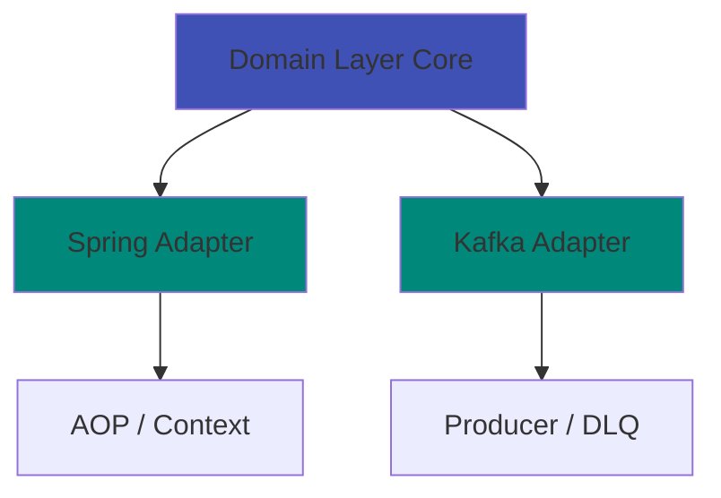

# Curve

<div class="badges" markdown>
[](https://openjdk.java.net/)
[](https://spring.io/projects/spring-boot)
[](https://kafka.apache.org/)
[](https://github.com/closeup1202/curve/blob/main/LICENSE)
[](https://github.com/closeup1202/curve/actions)
</div>

**Declarative Event Publishing Library for Spring Boot Microservices**

Curve is a production-ready library that simplifies event-driven architecture in Spring Boot applications. With a single annotation, you get automatic Kafka publishing, PII masking, DLQ handling, and comprehensive observability.

---

## :rocket: Quick Start

### Installation

=== "Gradle"

    ```gradle
    dependencies {
        implementation 'io.github.closeup1202:curve:0.1.2'
    }
    ```

=== "Maven"

    ```xml
    <dependency>
        <groupId>io.github.closeup1202</groupId>
        <artifactId>curve</artifactId>
        <version>0.1.2</version>
    </dependency>
    ```

### Configuration

```yaml title="application.yml"
spring:
  kafka:
    bootstrap-servers: localhost:9092

curve:
  enabled: true
  kafka:
    topic: event.audit.v1
    dlq-topic: event.audit.dlq.v1
```

### Usage

```java title="OrderService.java"
import io.github.closeup1202.curve.spring.audit.annotation.PublishEvent;

@Service
public class OrderService {

    @PublishEvent(eventType = "ORDER_CREATED")
    public Order createOrder(OrderRequest request) {
        return orderRepository.save(new Order(request));
    }
}
```

**That's it!** :tada: Curve automatically handles:

- :white_check_mark: Event ID generation (Snowflake)
- :white_check_mark: Metadata extraction (trace ID, user, IP)
- :white_check_mark: PII masking/encryption
- :white_check_mark: Kafka publishing with retries
- :white_check_mark: Dead Letter Queue (DLQ)
- :white_check_mark: Metrics collection

[Get Started →](getting-started/quick-start.md){ .md-button .md-button--primary }
[View on GitHub →](https://github.com/closeup1202/curve){ .md-button }

---

## :fire: Why Curve?

### Before vs After

<div class="grid cards" markdown>

-   :material-close-circle:{ .lg .middle } **Before (50+ lines)**

    ---

    ```java
    @Service
    public class UserService {
        @Autowired KafkaTemplate kafka;

        public User createUser(UserRequest req) {
            User user = repo.save(new User(req));

            try {
                // Manual event creation
                EventEnvelope event = EventEnvelope.builder()
                    .eventId(UUID.randomUUID().toString())
                    .eventType("USER_CREATED")
                    .occurredAt(Instant.now())
                    .metadata(/* ... */)
                    .payload(/* ... */)
                    .build();

                // Manual PII masking
                String json = maskPii(
                    objectMapper.writeValueAsString(event)
                );

                // Manual Kafka send
                kafka.send("user-events", json)
                    .get(30, TimeUnit.SECONDS);

            } catch (Exception e) {
                log.error("Failed", e);
                sendToDlq(event);
            }

            return user;
        }
    }
    ```

-   :material-check-circle:{ .lg .middle } **After (1 annotation)**

    ---

    ```java
    @Service
    public class UserService {

        @PublishEvent(eventType = "USER_CREATED")
        public User createUser(UserRequest req) {
            return repo.save(new User(req));
        }
    }
    ```

    **90% less code** :sparkles:

</div>

---

## :star: Key Features

<div class="grid cards" markdown>

-   :material-gesture-tap-button:{ .lg .middle } **Declarative Publishing**

    ---

    No Kafka boilerplate - just add `@PublishEvent` annotation. Supports SpEL for flexible payload extraction.

    [:octicons-arrow-right-24: Learn more](features/declarative-publishing.md)

-   :material-package-variant:{ .lg .middle } **Standardized Events**

    ---

    All events follow a unified schema with metadata (source, actor, trace, tags).

    [:octicons-arrow-right-24: Event Structure](features/overview.md#event-structure)

-   :material-shield-check:{ .lg .middle } **3-Tier Failure Recovery**

    ---

    **Main Topic → DLQ → Local File Backup**

    Zero event loss even when Kafka is down.

    [:octicons-arrow-right-24: Failure Recovery](features/failure-recovery.md)

-   :material-lock:{ .lg .middle } **Automatic PII Protection**

    ---

    `@PiiField` annotation automatically masks/encrypts sensitive data.

    [:octicons-arrow-right-24: PII Protection](features/pii-protection.md)

-   :material-lightning-bolt:{ .lg .middle } **High Performance**

    ---

    - **Sync**: ~500 TPS
    - **Async**: ~10,000+ TPS
    - **Transactional Outbox**: Atomicity guaranteed

    [:octicons-arrow-right-24: Performance](features/transactional-outbox.md)

-   :material-chart-line:{ .lg .middle } **Built-in Observability**

    ---

    Health checks, custom metrics, and detailed event tracking out of the box.

    [:octicons-arrow-right-24: Observability](features/observability.md)

</div>

---

## :test_tube: Comparison

| Feature | Spring Events | Spring Cloud Stream | Curve |
|---------|--------------|---------------------|-------|
| Kafka Integration | :x: | :white_check_mark: | :white_check_mark: |
| Declarative Usage | :white_check_mark: | :warning: Partial | :white_check_mark: |
| Standardized Schema | :x: | :x: | :white_check_mark: |
| PII Protection | :x: | :x: | :white_check_mark: |
| DLQ Support | :x: | :white_check_mark: | :white_check_mark: |
| Local File Backup | :x: | :x: | :white_check_mark: |
| Health Check | :x: | :x: | :white_check_mark: |
| Transactional Outbox | :x: | :x: | :white_check_mark: |
| **Boilerplate Code** | **Medium** | **High** | **Minimal** |

---

## :building_construction: Architecture

Curve follows **Hexagonal Architecture** (Ports & Adapters) for maximum flexibility:



**Core Principles:**

- :pushpin: **Framework-independent domain model**
- :pushpin: **Dependency Inversion (DIP)**
- :pushpin: **Easy to test and extend**

[:octicons-arrow-right-24: Architecture Details](features/overview.md#architecture)

---

## :dart: Use Cases

### 1. Audit Logging

```java
@PublishEvent(eventType = "USER_LOGIN", severity = INFO)
public User login(String username, String password) {
    return authService.authenticate(username, password);
}
```

### 2. Event-Driven Architecture

```java
@PublishEvent(eventType = "ORDER_COMPLETED")
public Order completeOrder(Long orderId) {
    Order order = orderRepository.findById(orderId);
    order.setStatus(OrderStatus.COMPLETED);
    return orderRepository.save(order);
}
```

### 3. Data Pipeline

```java
@PublishEvent(eventType = "CUSTOMER_REGISTERED")
public Customer registerCustomer(CustomerRequest request) {
    // Event automatically flows to data lake/warehouse
    return customerRepository.save(new Customer(request));
}
```

---

## :books: Documentation

<div class="grid cards" markdown>

-   :material-rocket-launch:{ .lg .middle } **Getting Started**

    ---

    Quick setup guide and your first event in 5 minutes

    [:octicons-arrow-right-24: Quick Start](getting-started/quick-start.md)

-   :material-cog:{ .lg .middle } **Configuration**

    ---

    Comprehensive configuration guide for production

    [:octicons-arrow-right-24: Configuration](CONFIGURATION.md)

-   :material-server:{ .lg .middle } **Operations**

    ---

    Production deployment and best practices

    [:octicons-arrow-right-24: Operations](OPERATIONS.md)

-   :material-help-circle:{ .lg .middle } **Troubleshooting**

    ---

    Common issues and solutions

    [:octicons-arrow-right-24: Troubleshooting](TROUBLESHOOTING.md)

</div>

---

## :handshake: Community

- **GitHub**: [closeup1202/curve](https://github.com/closeup1202/curve)
- **Issues**: [Report a bug](https://github.com/closeup1202/curve/issues)
- **Email**: closeup1202@gmail.com

[:octicons-arrow-right-24: Contributing Guide](../CONTRIBUTING.md)

---

## :memo: License

This project is licensed under the MIT License - see the [LICENSE](https://github.com/closeup1202/curve/blob/main/LICENSE) file for details.

---

<div class="footer-cta" markdown>

## Ready to simplify your event-driven architecture?

[Get Started Now →](getting-started/quick-start.md){ .md-button .md-button--primary .md-button--large }
[View Examples →](https://github.com/closeup1202/curve/tree/main/sample){ .md-button .md-button--large }

</div>
